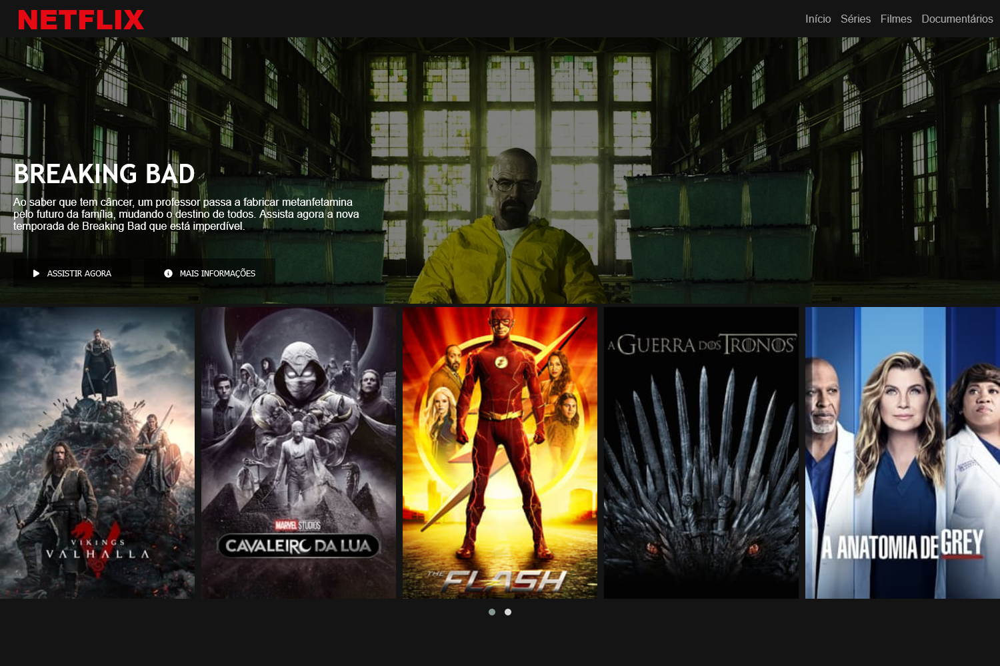

# Clone da página inicial da Netflix

> Sobre

Projeto construído para demonstrar um funcionamento básico do bootstrap, utilizando em conjunto HTML e CSS para dimensionar box model, carrosel e a responsividade do site.

## 🛠 Tecnologias 
- HTML
- CSS
- Bootstrap
- JavaScript
- Git
- Github

## 💻 Contato 

 > kennylima@hotmail.com